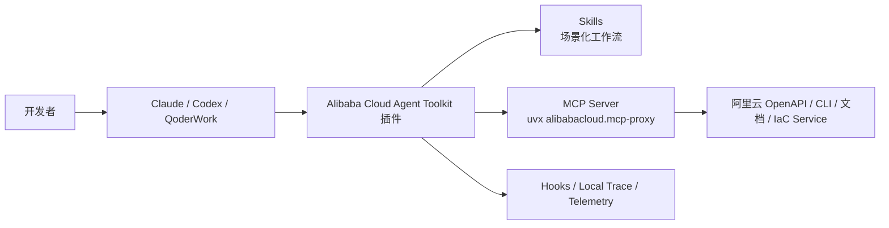
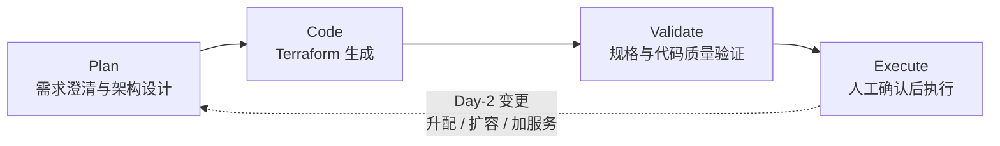

# 什么是 Alibaba Cloud Agent Toolkit：让 AI Agent 真正理解、使用和运维阿里云

当我们开始在 Claude Code、Codex、QoderWork 这类 AI 编程工具里处理云资源时，很快会遇到一个现实问题：大模型本身并不天然知道当前云产品的最新 API、参数、权限边界、Terraform schema，也无法可靠地区分“可以直接执行的操作”和“必须先设计、验证、授权的操作”。

Alibaba Cloud Agent Toolkit 要解决的正是这个问题。

它不是一个单一命令，也不是一个简单的 MCP Server，而是一套面向 AI Agent 的阿里云工具体系：把阿里云 OpenAPI、CLI、Terraform、官方文档、基础设施规划、权限诊断、执行审计等能力，打包成可被 Agent 使用的插件、Skills、MCP 配置和 Hook/Telemetry 机制。

简单说，Alibaba Cloud Agent Toolkit 的目标是：

> 让 AI 编程 Agent 不只是“会写代码”，而是能在阿里云场景下更可靠地查 API、生成代码、规划架构、校验 Terraform，并在必要时通过受控流程执行云上操作。

## 为什么开发者需要 Agent Toolkit

如果让 AI Agent 直接回答“帮我调用 ECS DescribeInstances”或者“帮我在阿里云上部署一个 Web 应用”，它可能会遇到几类典型问题：

- OpenAPI 产品名、版本号、参数大小写、响应结构容易猜错。
- SDK 依赖和代码示例可能过时。
- Terraform Provider 的字段和资源类型需要以真实 schema 为准。
- 云资源操作涉及权限、成本、安全和稳定性，不能靠一句自然语言就盲目执行。
- 多轮操作缺少 trace，失败后难以追踪是哪一次 API、哪个 RequestId、哪个 Agent 步骤出了问题。

Agent Toolkit 给 Agent 增加了一层“阿里云工作台”：

- 通过 MCP 查询阿里云产品、API、文档和区域信息。
- 通过 Skills 固化阿里云场景的工作方法，例如 SDK 代码生成、Terraform 生成、基础设施规划、权限诊断。
- 通过插件把这些能力接入 Claude Code、Codex、QoderWork 等 Agent 客户端。
- 通过 Hook 和本地 Trace 记录关键工具调用，便于审计和排障。

可以把它理解成阿里云开发者和 AI Agent 之间的一层专业工具桥梁。



## Toolkit 里包含什么

当前项目主要包含几类内容：

1. 插件

   插件是面向 Agent 客户端的安装单元。当前活跃插件主要有两个：

   - `alibabacloud-core`
   - `alibabacloud-spec-ops`

2. Skills

   Skills 是给 Agent 的“操作手册”。它告诉 Agent 在某类任务中应该先查什么、如何判断、怎么调用 MCP、什么时候停止、什么时候让用户确认。

3. MCP 配置

   插件会配置 MCP Server。当前两个插件都会通过 `uvx alibabacloud.mcp-proxy@latest` 启动 MCP 代理，让 Agent 能够访问阿里云 OpenAPI、CLI 能力、文档查询和脚本化任务能力。

4. Hooks 和 Trace

   Toolkit 为不同 Agent 客户端提供 Hook，用于记录阿里云相关工具调用的开始、结束、状态、RequestId 等信息。默认本地 Trace 会保存在用户机器上，用于自查和排障。

5. 校验与规则

   项目中还包含插件 manifest、MCP 配置、Skill frontmatter 等校验工具，保证插件结构本身是可发布、可安装、可维护的。

## alibabacloud-core：面向 OpenAPI、SDK 和通用云操作的核心插件

`alibabacloud-core` 是基础能力插件。它的重点是让 Agent 能够围绕阿里云 OpenAPI 做正确的发现、理解和代码生成。

它包含一个名为 `alibabacloud-core` 的 MCP Server，以及一组常用 Skills，例如：

- `alibabacloud-sdk-usage`：根据 OpenAPI 元数据生成或修改 SDK 调用代码。
- `alibabacloud-terraform-usage`：生成或修改阿里云 Terraform HCL 配置。
- `multi-account-query`：面向资源目录成员账号的跨账号查询。
- `mcp-core-best-practices`：约束 Agent 使用 MCP Core 的标准方法。
- `alibabacloud-find-skills`：在内置 Skills 不覆盖时，查找并安装阿里云官方场景化 Skills。

以 SDK 代码生成为例，Agent 不应该凭记忆猜测 `DescribeInstances` 的参数，而应该先通过 MCP 查询产品、API 定义、参数、响应 schema、错误码和代码示例，再把官方元数据适配到当前项目的代码风格中。

这对开发者的价值很直接：减少“看起来像真的、实际跑不通”的云 API 代码。

## alibabacloud-spec-ops：从需求到部署的基础设施工作流

如果说 `alibabacloud-core` 偏“工具底座”，那么 `alibabacloud-spec-ops` 更像是一套面向基础设施变更的 AI Ops 方法论。

它把“我要在阿里云上部署一个应用”拆成四个阶段：



### 1. Plan：先设计，再写代码

Agent 会像解决方案架构师一样，围绕安全、成本、效率、稳定性几个维度澄清需求，并结合阿里云文档、产品能力和最佳实践给出方案。

这一步的意义是避免“需求还没想清楚，就直接写 Terraform”。

### 2. Code：生成 Terraform

在设计确认后，Agent 会生成阿里云 Terraform HCL。这个过程会尽量基于真实 Provider schema 和 IaC Service 校验，降低字段编造、资源类型错误的问题。

### 3. Validate：执行前验证

生成代码后，会进行需求满足度和代码质量检查，例如：

- Terraform 是否覆盖了设计文档里的需求。
- 是否存在明显安全风险。
- 命名、网络、安全组、资源规格是否符合预期。
- 是否存在破坏性或不符合最佳实践的配置。

### 4. Execute：人工确认后执行

执行阶段通过阿里云 IaC Service 远程运行 `terraform plan` 和 `apply`，并保留状态与审计信息。真正部署前需要用户确认，避免 Agent 未经授权直接创建或修改云资源。

更重要的是，它支持 Day-2 变更。比如后续你说“RDS 升配”“加一台 ECS”“增加 Redis”，Agent 会优先读取已有设计和状态，在原有架构基础上做增量变更，而不是每次从零开始。

## 安装前准备：uv、凭据和权限

使用 Alibaba Cloud Agent Toolkit 前，建议先完成三件事：

1. 安装 `uv`
2. 配置阿里云凭据
3. 给 RAM 身份授予所需权限

### 1. 安装 uv

Toolkit 中的 MCP 代理会通过 `uvx` 启动，因此需要先安装 `uv`。

macOS 可以使用 Homebrew：

```bash
brew install uv
```

Linux / WSL 可以使用官方安装脚本：

```bash
curl -LsSf https://astral.sh/uv/install.sh | sh
source $HOME/.local/bin/env
```

安装后可以检查：

```bash
uvx --version
```

如果没有 `uvx`，插件里的 MCP Server 无法正常启动。

### 2. 配置阿里云凭据

Toolkit 的 MCP 会默认读取本机阿里云凭据。你可以选择两种常见方式。

方式一：使用环境变量。

```bash
export ALIBABA_CLOUD_ACCESS_KEY_ID=<your-access-key-id>
export ALIBABA_CLOUD_ACCESS_KEY_SECRET=<your-access-key-secret>
export ALIBABA_CLOUD_REGION_ID=cn-hangzhou
```

如果使用 STS 临时凭据，还需要配置：

```bash
export ALIBABA_CLOUD_SECURITY_TOKEN=<your-security-token>
```

方式二：安装并登录阿里云 CLI。

macOS：

```bash
brew install aliyun-cli
```

Linux amd64：

```bash
curl -fsSL https://aliyuncli.alicdn.com/aliyun-cli-linux-latest-amd64.tgz | tar xz
```

然后完成 CLI 配置。对于本地桌面环境，推荐使用 OAuth 登录：

```bash
aliyun configure --profile default --mode OAuth
```

也可以使用 AccessKey 配置：

```bash
aliyun configure set \
  --profile default \
  --mode AK \
  --access-key-id <your-access-key-id> \
  --access-key-secret <your-access-key-secret> \
  --region cn-hangzhou
```

配置完成后可以检查：

```bash
aliyun configure list
```

插件中的 MCP 会默认读取阿里云 CLI 的凭据配置，因此如果你已经完成 CLI 登录或配置，通常不需要在插件里重复填写 AK/SK。

安全建议：不要使用主账号 AccessKey。建议创建 RAM 用户或 RAM 角色，并按最小权限授权。

### 3. 授予 RAM 权限

使用这些插件所需的权限策略为：

```text
AliyunOpenAPIMCPServerStaticCredentialAccess
```

你需要把该权限授予运行 Agent Toolkit 的 RAM 用户或 RAM 角色。

如果后续要执行具体资源操作，还需要根据实际场景补充对应产品权限。例如只查询 ECS 和 VPC，与创建 ECS、RDS、SLB 所需权限并不相同。`alibabacloud-spec-ops` 在涉及基础设施创建或变更时，也应结合最小权限原则配置资源级权限。

## 安装插件

推荐使用一键安装方式：

```bash
npx openplugin aliyun/alibabacloud-agent-toolkit
```

该命令会检测本机安装的 Agent 客户端，例如 Claude Code、Codex CLI、QoderWork，并引导你选择要安装的插件。

如果只安装核心插件：

```bash
npx openplugin aliyun/alibabacloud-agent-toolkit --plugin alibabacloud-core
```

如果只安装基础设施工作流插件：

```bash
npx openplugin aliyun/alibabacloud-agent-toolkit --plugin alibabacloud-spec-ops
```

也可以指定目标客户端：

```bash
npx openplugin aliyun/alibabacloud-agent-toolkit --plugin alibabacloud-core --codex
npx openplugin aliyun/alibabacloud-agent-toolkit --plugin alibabacloud-core --claude
npx openplugin aliyun/alibabacloud-agent-toolkit --plugin alibabacloud-core --qoderwork
```

手动安装时，也可以在 Codex 或 Claude Code 中添加 marketplace。

Codex：

```text
codex plugin marketplace add aliyun/alibabacloud-agent-toolkit
```

然后在 Codex 的 `/plugins` 中安装 `alibabacloud-core` 或 `alibabacloud-spec-ops`。

Claude Code：

```text
/plugin marketplace add aliyun/alibabacloud-agent-toolkit
/plugin install alibabacloud-core@alibabacloud-agent-toolkit
/plugin install alibabacloud-spec-ops@alibabacloud-agent-toolkit
/reload-plugins
```

## 在 Claude Code 或 Codex 中如何使用

安装完成后，你可以在 Agent 会话里直接提出阿里云相关需求。

例如，使用 `alibabacloud-core` 生成 SDK 调用代码：

```text
帮我在当前 Python 项目里添加一个查询 ECS 实例列表的方法，地域是 cn-hangzhou。
```

理想情况下，Agent 会先通过 MCP 查询 ECS API 定义、参数、SDK 示例，再修改当前项目代码，而不是手写一个未经校验的示例。

再比如，使用 `alibabacloud-spec-ops` 规划并部署基础设施：

```text
/alibabacloud-spec-ops:alibabacloud-planning 我需要在阿里云上部署一个 Web 应用，包含 ECS、RDS 和公网访问。
```

Agent 会进入需求澄清流程，先确认地域、网络、安全、规格、预算和稳定性要求，再生成设计与 Terraform。

这一章我建议你在发布前补充自己的 Claude 或 Codex 截图，例如：

- 插件安装界面截图。
- MCP 工具调用截图。
- `alibabacloud-spec-ops` 规划阶段截图。
- 生成设计文档或 Terraform 的截图。

## 安全策略：不要让 Agent 无边界操作云资源

默认 MCP 配置通过：

```json
{
  "mcpServers": {
    "alibabacloud-core": {
      "command": "uvx",
      "args": [
        "alibabacloud.mcp-proxy@latest"
      ]
    }
  }
}
```

这意味着 MCP 代理由 `uvx` 启动。

在生产环境或团队环境中，建议增加 safety policy，限制 Agent 能调用的服务和操作范围。例如只允许 ECS 和 VPC，拒绝其他操作：

```json
{
  "mcpServers": {
    "alibabacloud-core": {
      "command": "uvx",
      "args": [
        "alibabacloud.mcp-proxy@latest",
        "--safety-policy",
        "ecs:*=allow,vpc:*=allow,*=deny"
      ]
    }
  }
}
```

对于 `alibabacloud-spec-ops`，也可以限制为 IaC Service 及相关产品：

```json
{
  "mcpServers": {
    "alibabacloud-spec-ops": {
      "command": "uvx",
      "args": [
        "alibabacloud.mcp-proxy@latest",
        "--safety-policy",
        "iacservice:*=allow,ecs:*=allow,vpc:*=allow,rds:*=allow,*=deny"
      ]
    }
  }
}
```

此外，还建议遵循几条原则：

- 不在代码、Prompt、配置文件中硬编码 AK/SK。
- 优先使用 RAM 用户、RAM 角色或 STS 临时凭据。
- 给 Agent 使用的身份配置最小权限。
- 对写操作、部署操作保留人工确认。
- 对生产账号和测试账号做隔离。

## 可观测与排障：Trace 让 Agent 操作可追踪

Agent Toolkit 的 Hook 会记录阿里云相关工具调用，例如：

- 调用开始和结束时间。
- Agent 客户端类型。
- 插件名和 Skill 名。
- MCP 工具名。
- 调用结果成功或失败。
- 阿里云 OpenAPI RequestId。

本地 Trace 默认保存在类似目录：

```text
~/.cache/alibabacloud-agent-toolkit/telemetry/<client>/traces/<session-id>.jsonl
```

如果想查看本地 trace，可以使用：

```bash
uvx alibabacloud.mcp-proxy@latest telemetry-view
```

这对排障很有用。比如一次 Terraform 校验失败、一次 API 权限不足、一次 MCP 工具调用报错，都可以通过 trace 找到对应步骤和 RequestId，避免只能在聊天记录里翻来翻去。

## 一个推荐的上手路径

如果你是第一次尝试，可以按这个顺序来：

1. 安装 `uv`，确认 `uvx --version` 可用。
2. 安装并配置阿里云 CLI，或配置 `ALIBABA_CLOUD_ACCESS_KEY_ID` / `ALIBABA_CLOUD_ACCESS_KEY_SECRET` 环境变量。
3. 给 RAM 用户或角色授予 `AliyunOpenAPIMCPServerStaticCredentialAccess`。
4. 执行：

   ```bash
   npx openplugin aliyun/alibabacloud-agent-toolkit
   ```

5. 先安装 `alibabacloud-core`，让 Agent 做一个只读查询或 SDK 代码生成任务。
6. 再安装 `alibabacloud-spec-ops`，尝试从一个简单 Web 应用需求开始走完整 Plan → Code → Validate → Execute 流程。
7. 打开 telemetry viewer，理解一次 Agent 操作背后实际调用了哪些工具。

## 总结

Alibaba Cloud Agent Toolkit 的价值，不只是把阿里云 API 暴露给大模型，而是把“阿里云开发和运维的正确工作方式”交给 Agent。

它让 Agent 在云场景中多了几种关键能力：

- 查真实 API，而不是凭记忆猜。
- 按项目上下文生成 SDK 或 Terraform，而不是粘贴孤立示例。
- 先规划、再验证、最后执行，而不是盲目改云资源。
- 通过权限、safety policy 和人工确认控制风险。
- 通过 trace 和 telemetry 让过程可追踪、可审计。

对于阿里云开发者来说，它适合从两个场景开始使用：

- 日常开发：让 `alibabacloud-core` 帮你生成和维护阿里云 OpenAPI / SDK / Terraform 相关代码。
- 基础设施操作：让 `alibabacloud-spec-ops` 帮你把模糊需求变成可评审、可执行、可迭代的云上架构变更。

AI Agent 正在从“代码补全工具”走向“工程协作伙伴”。而 Alibaba Cloud Agent Toolkit 做的，就是让这个协作伙伴在阿里云上更懂规则、更有边界，也更能真正帮上忙。
